# MONORYX Installation Guide & Tutorials

MONORYX is a lightweight native Minecraft Java Edition launcher built with Rust and egui. It features isolated instance management, offline and Microsoft authentication, companion-assisted updates, and integrated Modrinth and CurseForge catalogs.

> See [CHANGELOG.md](CHANGELOG.md) for full release details.

---

## Table of Contents

1. [Installing MONORYX](#installing-monoryx)
   - [Method A: Windows Installation Wizard (Recommended)](#method-a-windows-installation-wizard-recommended)
   - [Method B: Portable Zip (Windows)](#method-b-portable-zip-windows)
   - [Method C: macOS Disk Image (.dmg) & Universal Binaries](#method-c-macos-disk-image-dmg--universal-binaries)
   - [Method D: Linux (Installer Script & Tarball)](#method-d-linux-installer-script--tarball)
   - [Method E: Building from Source](#method-e-building-from-source)
2. [First Launch & Onboarding](#first-launch--onboarding)
3. [Tutorials](#tutorials)
   - [Tutorial 1: Creating Your First Minecraft Instance](#tutorial-1-creating-your-first-minecraft-instance)
   - [Tutorial 2: Discovering & Installing Mods (Modrinth & CurseForge)](#tutorial-2-discovering--installing-mods-modrinth--curseforge)
   - [Tutorial 3: Microsoft Authentication & Offline Profiles](#tutorial-3-microsoft-authentication--offline-profiles)
   - [Tutorial 4: Companion Updater (`monoryx-updater`)](#tutorial-4-companion-updater-monoryx-updater)
   - [Tutorial 5: Performance Optimization, Memory & Eco Mode](#tutorial-5-performance-optimization-memory--eco-mode)
   - [Tutorial 6: Worlds, Compression & Safe Restore](#tutorial-6-worlds-compression--safe-restore)
   - [Tutorial 7: Screenshot Viewer & Filmstrip Gallery](#tutorial-7-screenshot-viewer--filmstrip-gallery)
   - [Tutorial 8: Theming & Command Palette](#tutorial-8-theming--command-palette)
4. [Troubleshooting & FAQ](#troubleshooting--faq)

---

## Installing MONORYX

### Method A: Windows Installation Wizard (Recommended)

The Windows Setup Wizard installs MONORYX, registers Start Menu shortcuts, sets uninstaller entries, and bundles the companion updater.

#### 1. Download the Installer
Download `MONORYX-Setup-1.5.4.exe` from the [GitHub Releases page](https://github.com/DemonZ-Development/Monoryx/releases/tag/v1.5.4) or the [official project page](https://demonz.org/projects/monoryx).


#### 2. Open Downloads & Launch Setup
Navigate to your **Downloads** folder and open `MONORYX-Setup-1.5.4.exe`.


#### 3. Windows SmartScreen
If Windows SmartScreen prompts "Windows protected your PC":
- Click **More info**.


- Click **Run anyway**.


#### 4. Choose Installation Scope
- **Only for me** (Default): Installs to `%LOCALAPPDATA%\Programs\MONORYX` without administrator privileges.
- **For all users**: Installs system-wide to `C:\Program Files\MONORYX`.


#### 5. License Agreement
Review and accept the Apache 2.0 license.


#### 6. Destination Location & Shortcuts
Select the destination directory and configure your shortcut preferences.


#### 7. Complete Installation
Click **Install**. Setup copies the runtime files, writes shortcuts, and sets up `monoryx-updater.exe`.


---

### Method B: Portable Zip (Windows)

For portable USB installations or isolated folders:

1. Download `monoryx-v1.5.4-windows-x64.zip`.
2. Extract the archive into your preferred directory (such as `D:\Games\MONORYX`).
3. Keep `monoryx.exe` and `monoryx-updater.exe` in the same directory so companion updates function properly.
4. Launch `monoryx.exe`. Production builds run with `#![windows_subsystem = "windows"]`, so no background command prompt window opens.

---

### Method C: macOS Disk Image (.dmg) & Universal Binaries

MONORYX provides universal binaries supporting both Apple Silicon (M1/M2/M3/M4) and Intel x86_64 architectures on macOS 11.0+.

1. Download `monoryx-v1.5.4-macos-universal.dmg` (or architecture tarballs `monoryx-v1.5.4-macos-arm64.tar.gz` / `monoryx-v1.5.4-macos-x64.tar.gz`).
2. Double-click the `.dmg` file to mount it.
3. Drag **MONORYX** into your **Applications** folder.
4. If Gatekeeper prompts about an unnotarized binary on first launch, right-click `MONORYX.app` in Finder and select **Open**, or clear the quarantine flag via Terminal:
   ```bash
   xattr -cr /Applications/MONORYX.app
   ```

---

### Method D: Linux (Installer Script & Tarball)

#### Using the Shell Installer Script
1. Download `monoryx-installer-linux.sh`.
2. Make the script executable and run it:
   ```bash
   chmod +x monoryx-installer-linux.sh
   ./monoryx-installer-linux.sh
   ```
   The installer extracts the binary to `~/.local/bin/monoryx`, registers a desktop launcher entry at `~/.local/share/applications/monoryx.desktop`, and installs the application icon.

#### Using the Tarball Directly
1. Download `monoryx-v1.5.4-linux-x64.tar.gz`.
2. Extract the archive:
   ```bash
   tar -xzf monoryx-v1.5.4-linux-x64.tar.gz -C ~/.local/bin/
   chmod +x ~/.local/bin/monoryx
   ```
3. Required system libraries (installed via your package manager):
   - **Debian / Ubuntu**: `sudo apt install libasound2 libudev1 libdbus-1-3 libx11-6 libxcursor1 libxi6 libxrandr2 libwayland-client0 libxkbcommon0`
   - **Fedora**: `sudo dnf install alsa-lib systemd-libs dbus-libs libX11 libXcursor libXi libXrandr wayland-client libxkbcommon`
   - **Arch Linux**: `sudo pacman -S alsa-lib systemd-libs dbus libx11 libxcursor libxi libxrandr wayland libxkbcommon`

---

### Method E: Building from Source

To compile the latest release directly from source:

#### Prerequisites
- **Rust**: Rust 1.88+ (`rustup default stable`)
- **System build tools**:
  - Windows: MSVC C++ Build Tools or WinLibs UCRT.
  - Linux: `gcc`, `pkg-config`, `libasound2-dev`, `libudev-dev`, `libdbus-1-dev`.
  - macOS: Xcode Command Line Tools (`xcode-select --install`).

#### Build Steps
```bash
git clone https://github.com/DemonZ-Development/Monoryx.git
cd Monoryx
cargo build --release --bins
```
The compiled binaries are placed in `target/release/monoryx` and `target/release/monoryx-updater`.

---

## First Launch & Onboarding

When starting MONORYX for the first time, a compact three-step onboarding modal guides you through initial setup:

### Step 1: Introduction
Overview of isolated instance storage and offline-first design.

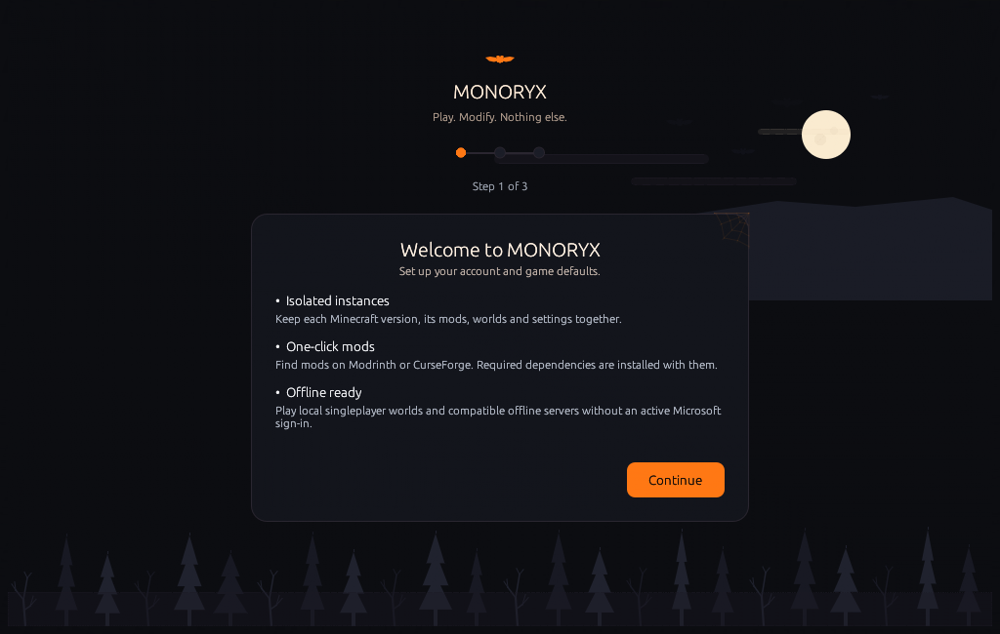

### Step 2: Account & Player Identity
Set up your primary profile. You can enter an offline nickname or click **Microsoft Login** to authenticate via the OAuth device code flow.

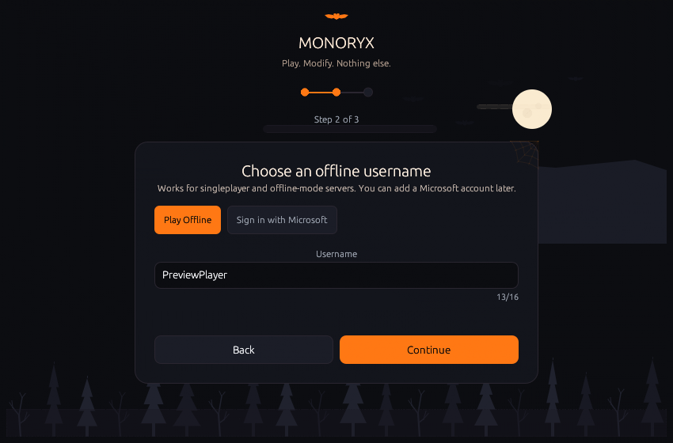

### Step 3: Runtime Defaults
Select your preferred memory allocation (Automatic detection or custom megabytes) and pick your preferred GPU (Integrated vs Dedicated). Text contrast in dropdowns ensures selected items remain clear.


Click **Finish Setup** to save configuration and open the Home view.

---

## Tutorials

### Tutorial 1: Creating Your First Minecraft Instance

Instances in MONORYX are isolated directories. Mod lists, configuration files, world saves, and shader settings never interfere across instances.

1. Navigate to **Instances** in the sidebar.
2. Click **+ New instance** in the header.

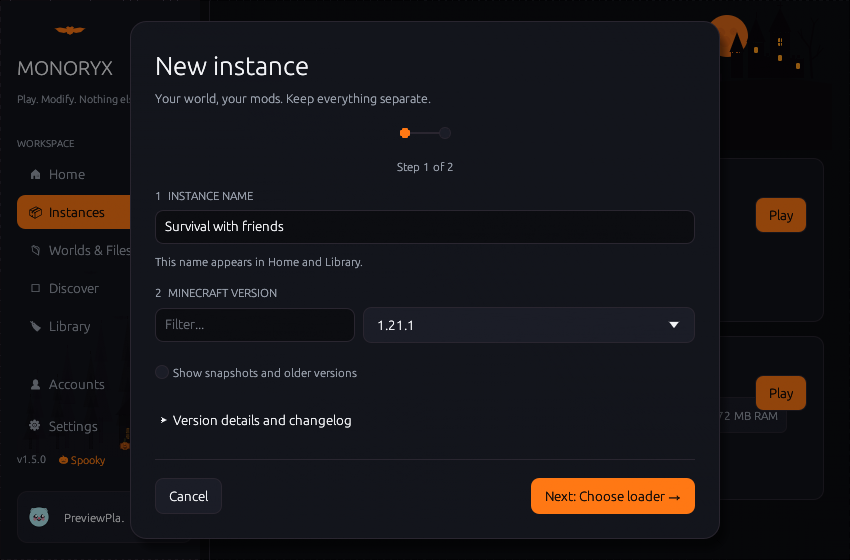

3. Configure instance attributes:
   - **Name**: e.g. `Fabric Survival 1.20.1`
   - **Version**: Any official release, snapshot, beta, or alpha.
   - **Loader**: `Vanilla`, `Fabric`, `NeoForge`, `Forge`, or `Quilt`.

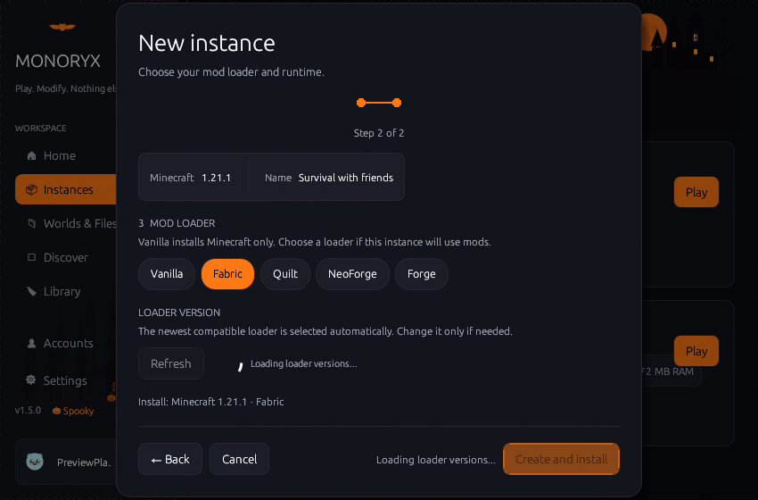

4. Click **Create instance**.
5. Return to **Home**. Your active instance appears in the central hero card with square action buttons: `Play Minecraft`, `Mods & packs`, `Worlds & backups`, and `Instance settings`.


6. Clicking **Play Minecraft** downloads required game jars, libraries, and assets with parallel SHA-1 verification.

---

### Tutorial 2: Discovering & Installing Mods (Modrinth & CurseForge)

MONORYX searches both Modrinth and CurseForge catalogs with unified one-click installation.

1. Select your target instance on **Home** or in the top navigation.
2. Click **Discover** in the sidebar.
3. Switch catalog sources between **Modrinth** and **CurseForge**. The search field dynamically updates its placeholder to reflect the selected source.
4. Select content type: **Mods**, **Modpacks**, **Resource packs**, or **Shader packs**.
5. Use version and loader pills to filter compatible entries.


6. Click an item to view project details in a floating modal dialog.

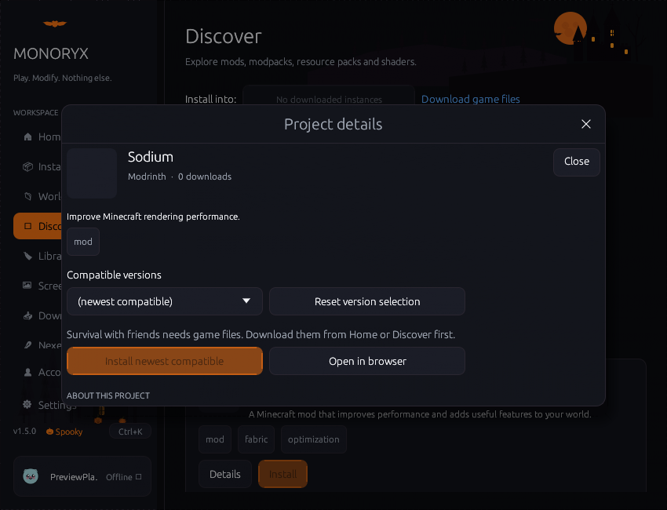

7. Click **Install**. If instance core assets are still downloading, MONORYX alerts you before proceeding.
8. Go to **Library** to enable, disable, or inspect dependency hierarchies in the compact mod list view.


---

### Tutorial 3: Microsoft Authentication & Offline Profiles

MONORYX supports verified Microsoft accounts alongside offline profiles:

#### Microsoft Login via Device Code Flow
1. Open **Accounts** in the sidebar.
2. Click **Add Account** -> **Microsoft Login**.
3. MONORYX displays an eight-character code and opens `https://microsoft.com/devicelogin`.
4. Enter the code in your browser and authorize your Microsoft account.
5. MONORYX exchanges the authentication token for Minecraft services, loads your Xbox gamertag, and fetches your player skin head avatar.

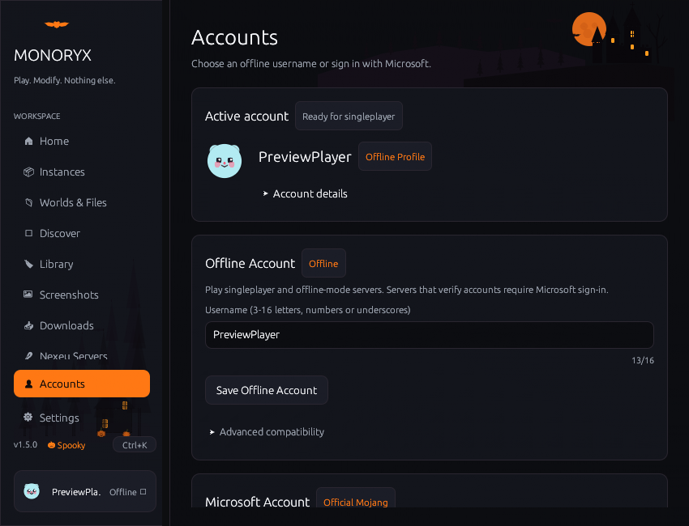

#### Advanced Compatibility Settings
Technical RFC4122 specifications, offline MD5 hash derivation, and SkinsRestorer options are grouped inside the collapsible **Advanced compatibility** section at the bottom of the Accounts page to keep the interface clear.

---

### Tutorial 4: Companion Updater (`monoryx-updater`) & Download Manager

The standalone companion binary handles atomic executable swapping, while the Downloads page provides animated multi-stage progress tracking:

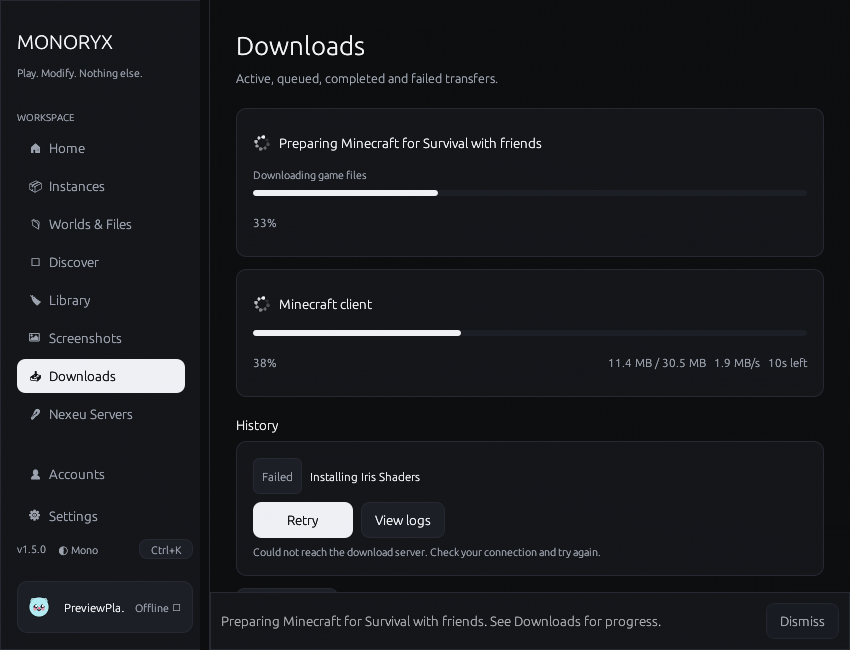

1. Open **Settings** -> **Launcher** and click **Check for updates**.
2. When a newer version is detected, release notes and hash verification details are displayed.
3. Click **Download Update**. MONORYX downloads the binary to a temporary file and verifies the SHA-256 hash.
4. Click **Restart to update**. MONORYX launches `monoryx-updater`, exits cleanly, swaps the executable, archives a backup, and relaunches the updated launcher.

---

### Tutorial 5: Performance Optimization, Memory & Eco Mode

MONORYX operates natively without Electron or Chromium runtimes, maintaining a lightweight background memory footprint:

- **Eco Mode**: Enable Eco Mode on specific instances or globally in Settings. Eco Mode limits memory consumption during casual play and pauses background repaint loops when the Minecraft client window is focused.
- **Hide When Game Starts**: In **Settings** -> **Launcher**, configure the launcher to minimize or hide while Minecraft is running to release GPU resources.
- **Dedicated GPU Preference**: On dual-GPU laptops (Intel/AMD integrated + NVIDIA/AMD dedicated), MONORYX instructs Windows to assign the high-performance dedicated graphics adapter to Java.

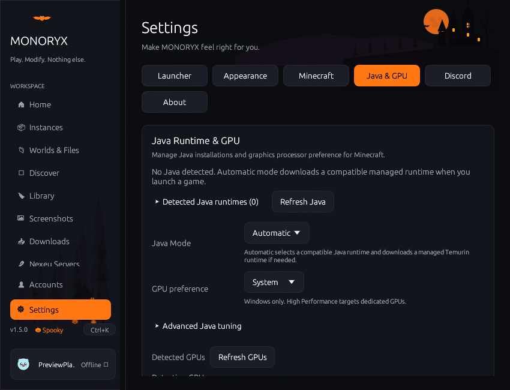

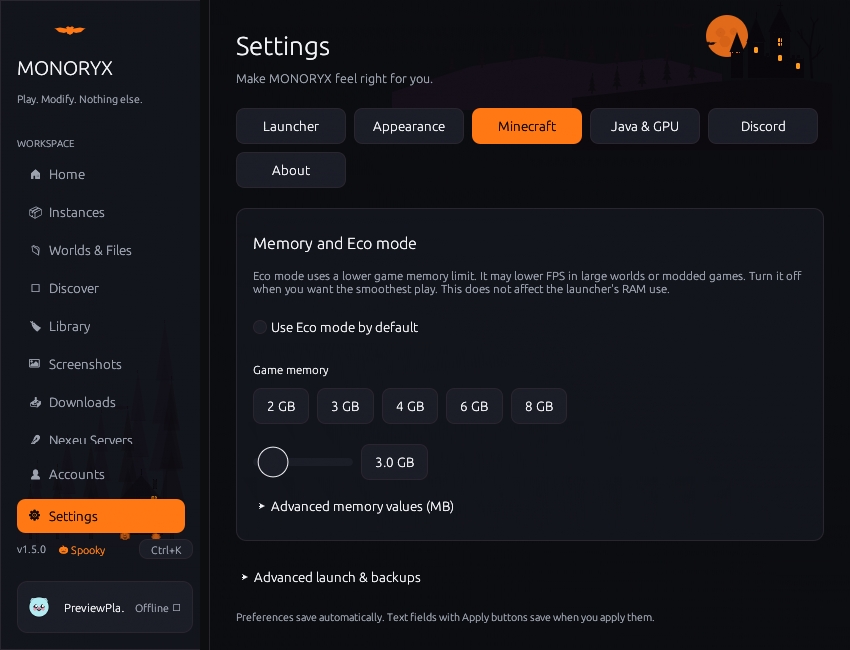

---

### Tutorial 6: Worlds, Compression & Safe Restore

The dedicated Worlds manager provides backup and directory inspection tools:

1. Click **Worlds & Files** in the sidebar or **Worlds & backups** on the Home hero card.
2. Select any world from the active instance.
3. Choose a backup compression level:
   - **Fast**: Quick archival with minimal CPU usage.
   - **Maximum**: Balanced compression.
   - **Smallest**: Maximum deflation for minimal disk space.
4. Click **Back Up World**. MONORYX writes a timestamped ZIP archive into the instance backups directory.
5. To recover a previous state, click **Restore as copy**. MONORYX restores the backup into a new world folder without overwriting existing data.


---

### Tutorial 7: Screenshot Viewer & Filmstrip Gallery

1. Click **Screenshots** in the sidebar, or click any preview thumbnail on the Home page filmstrip.
2. View full-resolution screenshots with `Previous` and `Next` navigation controls.
3. Click **Open in Explorer** / **Reveal in Finder** to access the source PNG file directly on disk.

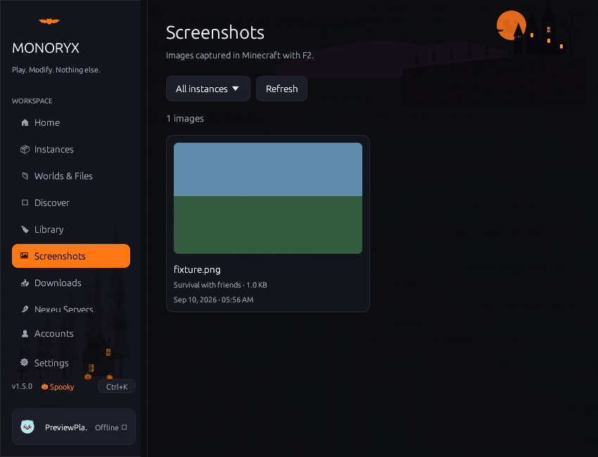

---

### Tutorial 8: Theming & Command Palette

- **Themes**: Go to **Settings** -> **Appearance** to toggle between themes:
  - **Halloween (Spooky)**: Silhouetted vector backdrop (haunted castle, glowing full moon, flying bats, pine forest), pumpkin corner accents, spiderweb cards, and glowing orange primary buttons.
  - **Dark / Light / Gloss / High Contrast**: Clean modern aesthetics tailored for readability and contrast.


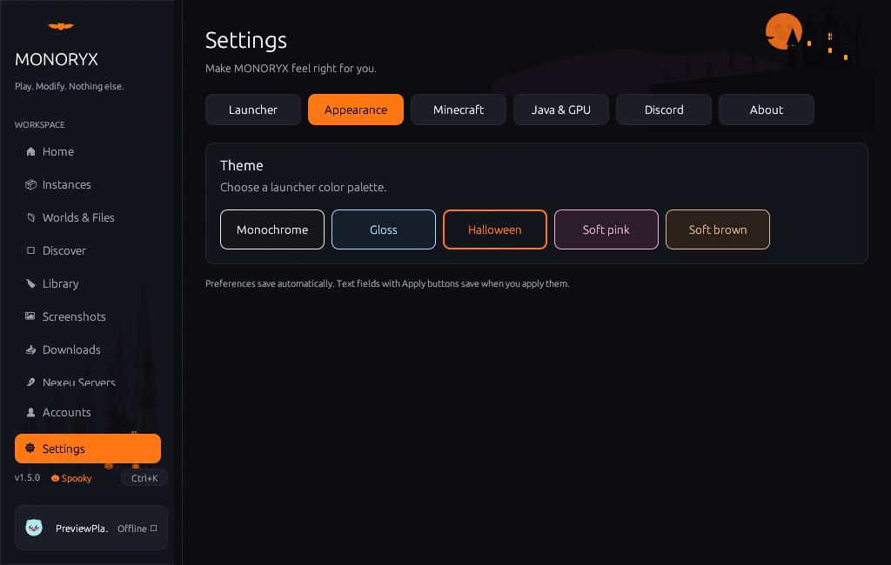

- **Command Palette**: Press `Ctrl+K` (or `Cmd+K` on macOS) anywhere in the application to open the quick launcher palette for instant page navigation, instance switching, and settings access.

---

## Troubleshooting & FAQ

#### Q: Minecraft crashes on startup?
MONORYX includes an automated crash diagnosis modal that parses JVM stack traces, identifies conflicting mods or missing libraries, and offers one-click log export.


#### Q: Missing Java runtime or game fails to start?
Open **Settings** -> **Java & Runtime**. Click **Auto-detect runtimes** or choose **Install Managed Temurin JRE** to download the appropriate Java 8, 17, or 21 runtime automatically.

#### Q: Missing glyphs or unreadable CJK characters?
MONORYX caches system fallback fonts (`Segoe UI`, `Malgun Gothic`, `Microsoft YaHei`, `MS Gothic` on Windows, and platform equivalents on macOS and Linux) at startup. Non-Latin and CJK text render properly across all interfaces.

#### Q: Does CurseForge require an API key?
No. CurseForge searches and mod downloads route through official endpoints out of the box. You can supply an optional custom developer key in **Settings** -> **Launcher** if desired.

#### Q: Can I run MONORYX completely offline?
Yes. Create an offline profile in **Accounts** to launch any previously installed instance without an active internet connection.
