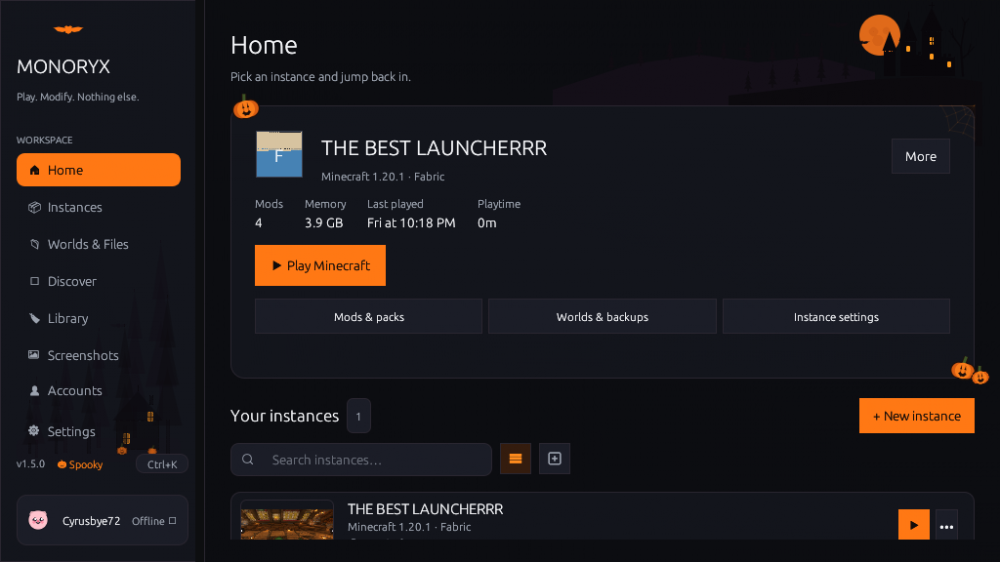
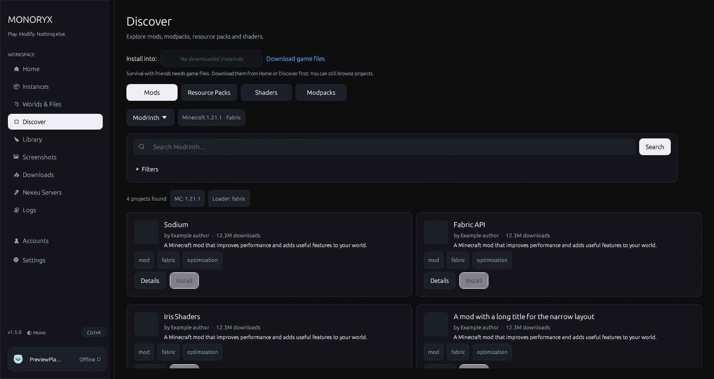
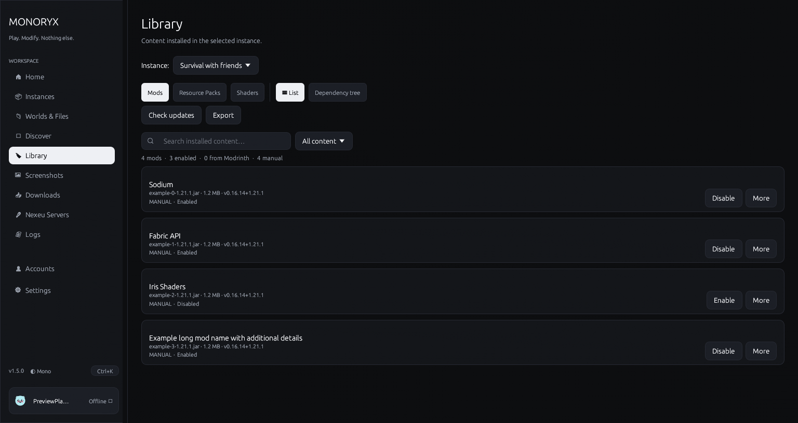
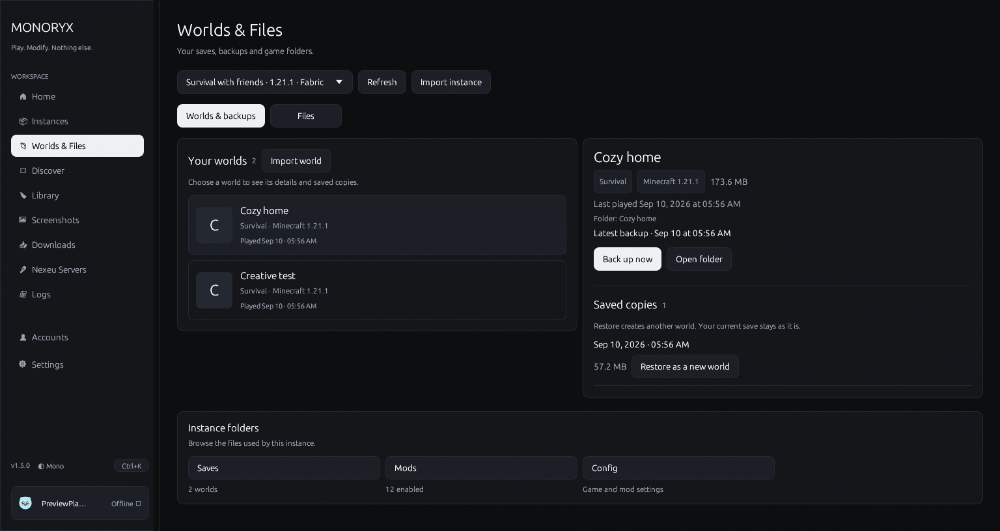
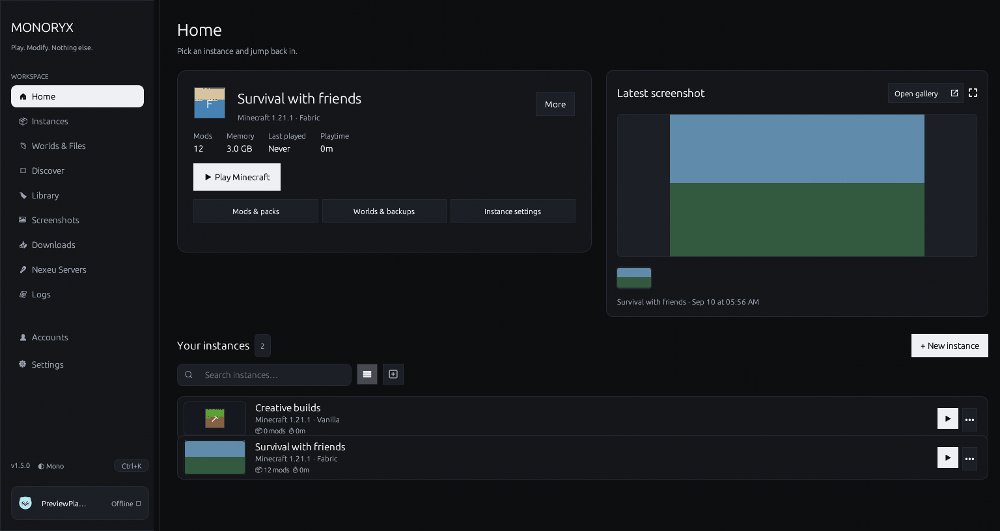
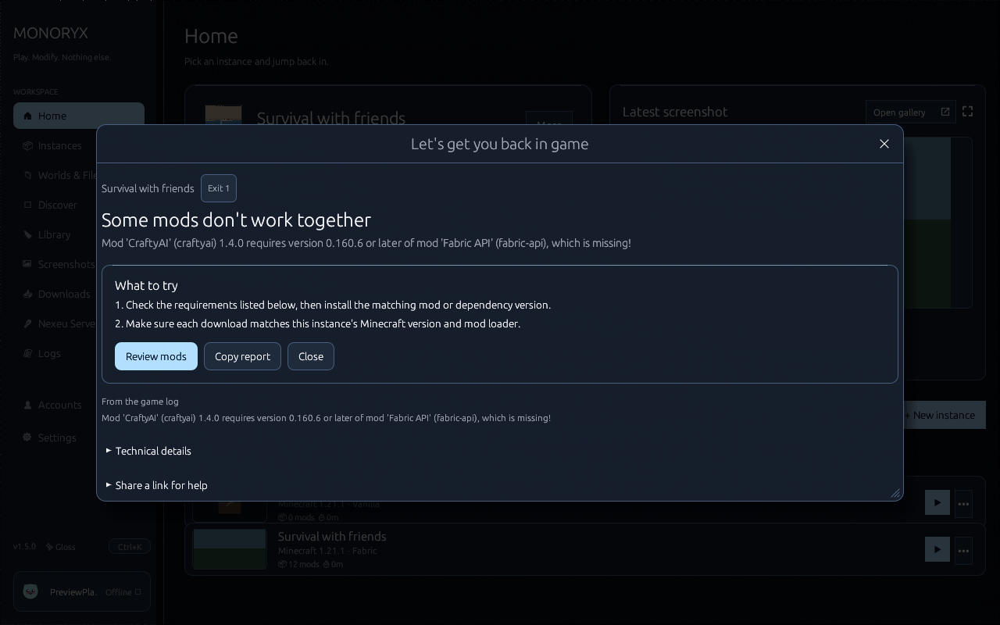
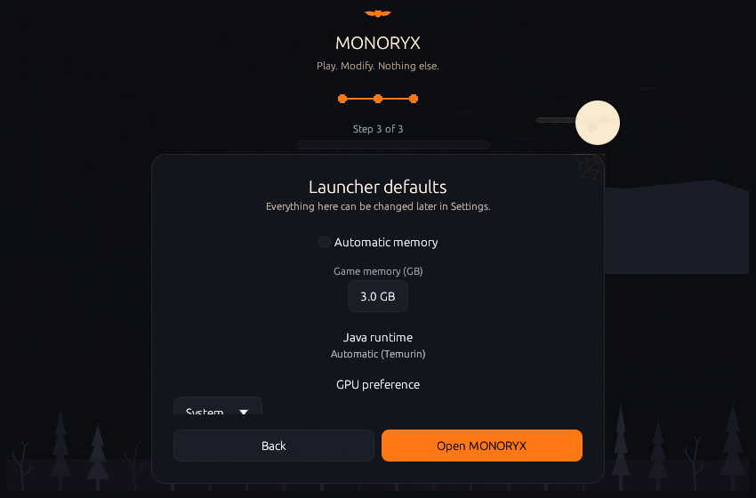

# MONORYX: Native Minecraft Java Launcher

### Minecraft, without the clutter. Native Rust performance, sandboxed instances, and dual-source mod discovery.

[**Download for Windows**](https://demonz.org/projects/monoryx) • [**Download for macOS**](https://demonz.org/projects/monoryx) • [**Download for Linux**](https://demonz.org/projects/monoryx) • [**Documentation**](README.md)

---

## Overview

MONORYX is a native Minecraft: Java Edition launcher written in Rust, `egui`, and `eframe`. Cold starts complete in under a second, and idle memory usage stays below 50 MB.

Each instance runs in an isolated directory with its own mods, saves, configs, and Java runtimes. Your default `.minecraft` directory remains untouched.

---

## Key Highlights

- **Native Performance**: Compiles to a native binary using OpenGL. Idle memory stays below 50 MB.
- **Unified Mod Ecosystem**: Search and install mods, resource packs, shaders, and modpacks from Modrinth and CurseForge in one interface.
- **Sandboxed Instance Directories**: Every profile maintains its own isolated directory for mods, configurations, world saves, and screenshots.
- **Automated Java Provisioning**: Detects installed JREs on your system and downloads matched Adoptium Temurin runtimes for any Minecraft version.
- **World Protection & Backups**: Safeguard worlds with one-click compressed ZIP backups and a restore-as-copy mechanism.
- **Flexible Authentication**: Sign in via Microsoft OAuth device code flow (`microsoft.com/link`) for official online servers, or use offline profiles for singleplayer and LAN play.
- **Handcrafted Themes**: Includes the seasonal Spooky (Halloween) theme with procedural vector artwork, alongside Gloss, High Contrast, Dark, and Light palettes.
- **Native Windows Build**: Compiles as a Windows subsystem GUI executable without opening a console window.

---

## Visual Showcase

| Discovery (Modrinth & CurseForge) | Mod Library & Dependency Tree |
|:---:|:---:|
|  |  |

| Worlds & Compressed Backups | Classic Monochrome Theme |
|:---:|:---:|
|  |  |

| Crash Diagnostic Analyzer | 3-Step Setup Wizard |
|:---:|:---:|
|  |  |

---

## Core Capabilities

### 1. Dual-Source Mod Browsing
Browse the catalog of Modrinth and CurseForge projects with version, loader, and category filters. The dependency resolver identifies required libraries and flags version mismatches before installation.

### 2. Dense Library Management
View installed mods in a compact table view with version selection, toggle switches, and an interactive dependency hierarchy. The update scanner uses Murmur2 fingerprints and jar hashes to check for new releases across both platforms.

### 3. Instance Sandbox
Support for Vanilla, Fabric, Quilt, NeoForge, and Forge loaders. Configure custom memory limits, JVM launch flags, and discrete GPU assignment. Instances export to portable ZIP packages for sharing.

### 4. Worlds & Backups
Manage world saves inside the launcher. Create compressed ZIP snapshots, inspect level metadata and seeds, browse world directories, and restore saves as distinct copies without overwriting original files.

### 5. Diagnostics & Crash Reporting
When a crash occurs, MONORYX parses the JVM stack trace, isolates failing mod IDs, and displays a summary. Export logs to disk or upload them to [mclo.gs](https://mclo.gs) with one click.

### 6. Screenshots & Media
Browse in-game screenshots from your selected instance in a full-size viewer with navigation controls. Home displays recent captures in a filmstrip preview strip.

---

## Technical Specifications

| Category | Specification |
|---|---|
| **Supported Loaders** | Vanilla, Fabric, Quilt, NeoForge, Forge |
| **Content Repositories** | Modrinth API (v2) and CurseForge API (v1 with Murmur2 hashing) |
| **Java Runtime Support** | Automatic Adoptium Temurin downloads (Java 8, 11, 17, 21, 25+) |
| **Minecraft Versions** | Release 1.0 through 1.21+ and official development snapshots |
| **Memory Management** | Adaptive system detection, Eco Mode, custom allocation bounds |
| **Launch Optimization** | AppCDS class data sharing, Aikar GC flags, discrete GPU preference |
| **Authentication** | Microsoft OAuth 2.0 Device Code flow, Offline profile generator |
| **Credential Security** | Windows Credential Manager, macOS Keychain, Linux Secret Service |
| **Supported Platforms** | Windows 10/11 (x64), macOS 11+ (Universal), Linux (glibc 2.31+) |
| **License** | Apache License 2.0 |

---

## System Requirements

### Minimum Requirements
- **Operating System**: Windows 10 (64-bit), macOS 11 (Big Sur), or modern Linux distribution
- **Processor**: 64-bit dual-core CPU (x86_64 or Apple Silicon)
- **RAM**: 4 GB system memory
- **Storage**: 150 MB available disk space for launcher and runtimes
- **Graphics**: OpenGL 3.3 compatible GPU

### Recommended Requirements
- **Operating System**: Windows 11, macOS 14 (Sonoma), or current Linux LTS
- **Processor**: Quad-core 64-bit CPU (3.0 GHz or higher) / Apple M-series
- **RAM**: 8 GB to 16 GB system memory (for large modpacks)
- **Storage**: SSD with 10 GB+ free space for Minecraft instances and assets
- **Graphics**: Dedicated GPU with latest vendor drivers

---

## Installation

### Windows
1. Download `MONORYX-Setup-1.5.3.exe` from [demonz.org/projects/monoryx](https://demonz.org/projects/monoryx).
2. Run the installer or extract the portable ZIP archive to your desired location.
3. Launch MONORYX, set your profile name, and click **Play**.

### macOS
1. Download `monoryx-v1.5.3-macos-universal.dmg`.
2. Open the disk image and drag `MONORYX.app` to your Applications folder.
3. Launch the app from Applications or Spotlight.

### Linux
1. Download `monoryx-v1.5.3-linux-x64.tar.gz`.
2. Extract the archive: `tar -xzf monoryx-v1.5.3-linux-x64.tar.gz`.
3. Run `./monoryx` from terminal or desktop shortcut.

---

## Community & Support

- **Official Website**: [demonz.org/projects/monoryx](https://demonz.org/projects/monoryx)
- **GitHub Repository**: [github.com/DemonZ-Development/Monoryx](https://github.com/DemonZ-Development/Monoryx)
- **Issue Tracker**: [github.com/DemonZ-Development/Monoryx/issues](https://github.com/DemonZ-Development/Monoryx/issues)
- **Changelog**: [CHANGELOG.md](CHANGELOG.md)
- **Installation Guide**: [INSTALLATION.md](INSTALLATION.md)

---

## Legal Notice

MONORYX is an open-source project published under the [Apache License 2.0](LICENSE) by DemonZ Development.

Minecraft is a registered trademark of Mojang Synergies AB. MONORYX is an independent utility and is not affiliated with, endorsed by, or associated with Mojang Studios or Microsoft.
